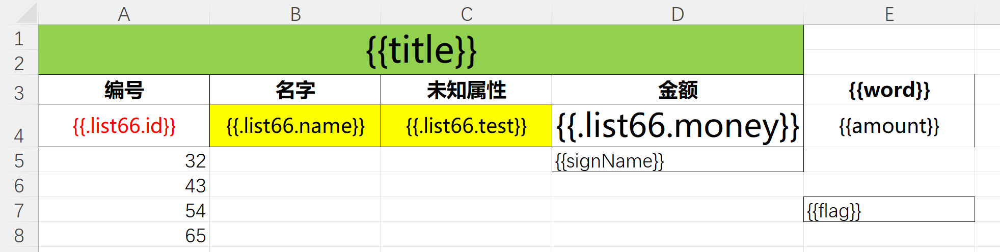
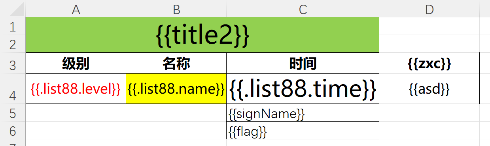
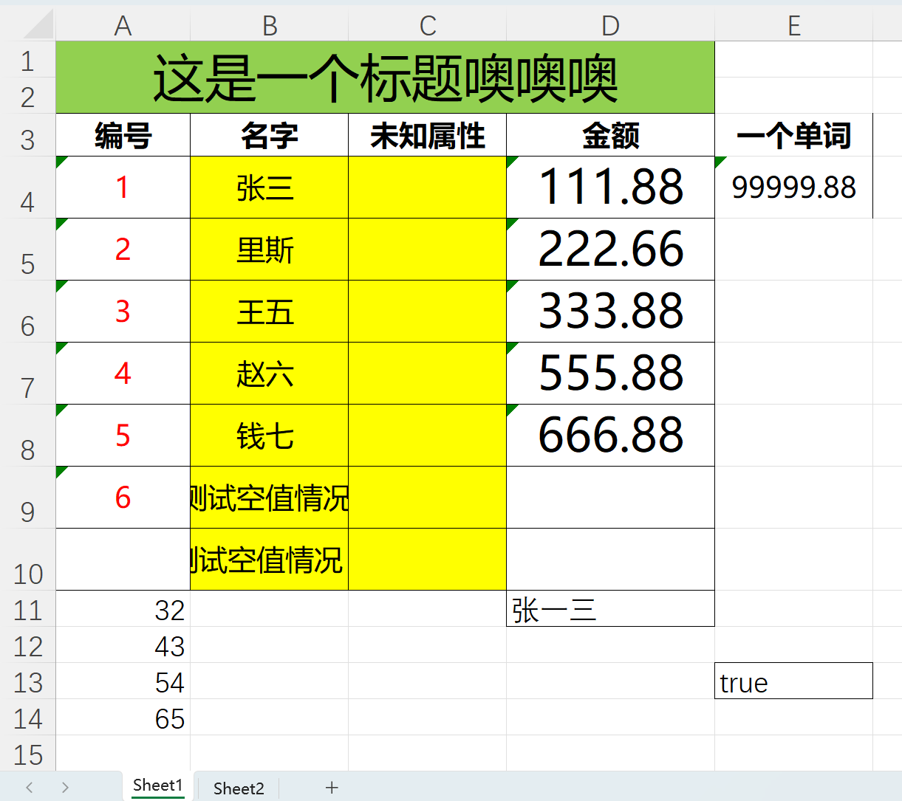
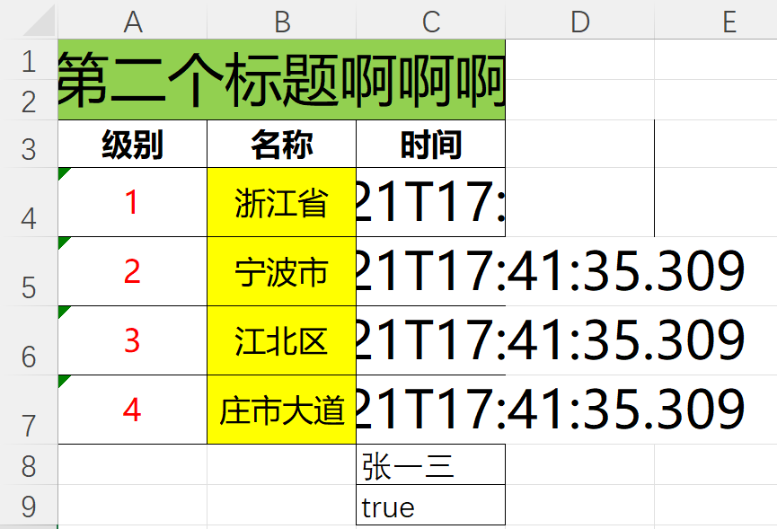
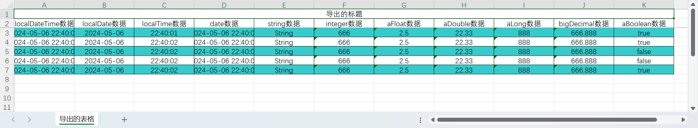

# excel-test
excel模板导出练习

## 介绍
- 鉴于easyExcel在填充list模板之后不能在添加数据这一缺陷。本人基于poi实现复杂Excel模板实现导出，在填充了List数据之后还允许填充模板数据。
- 使用方法直接看工具类 [ExcelExporterMultSheetUtils.java](src%2Fmain%2Fjava%2Fcom%2Fexample%2Fexceltest%2FExcelExporterMultSheetUtils.java)
- 使用之前应当先导入[pom.xml](pom.xml)里面的相关依赖。

## 例子
### 模板sheet1

### 模板sheet2

### sheet1结果

### sheet2结果

### 支持列表数据的导出导入，该工具类的请看[ExcelUtils.java](src%2Fmain%2Fjava%2Fcom%2Fexample%2Fexceltest%2FExcelUtils.java)

## Author：[LuoXianchao]()
